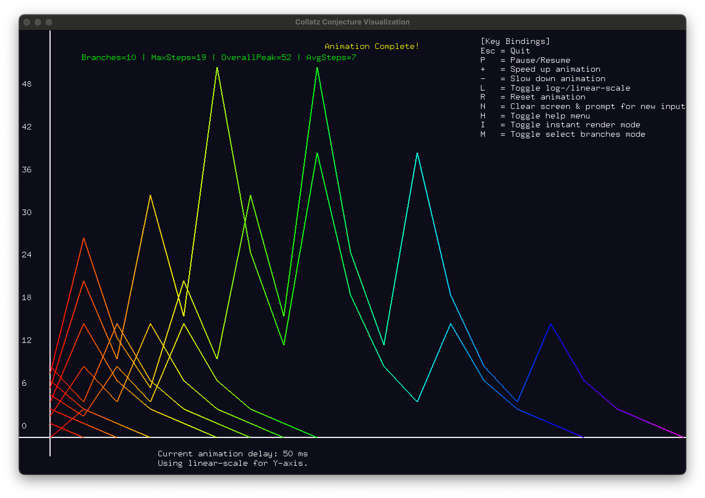
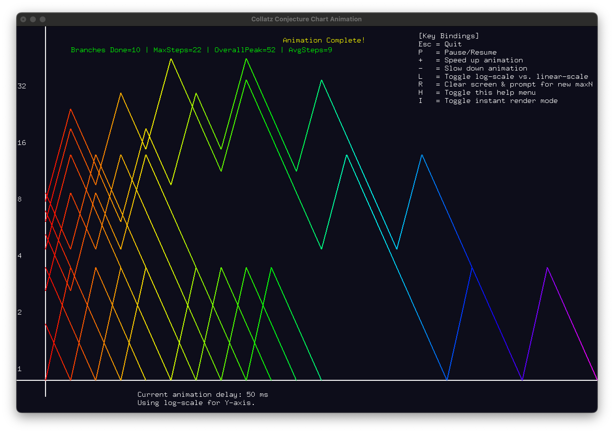
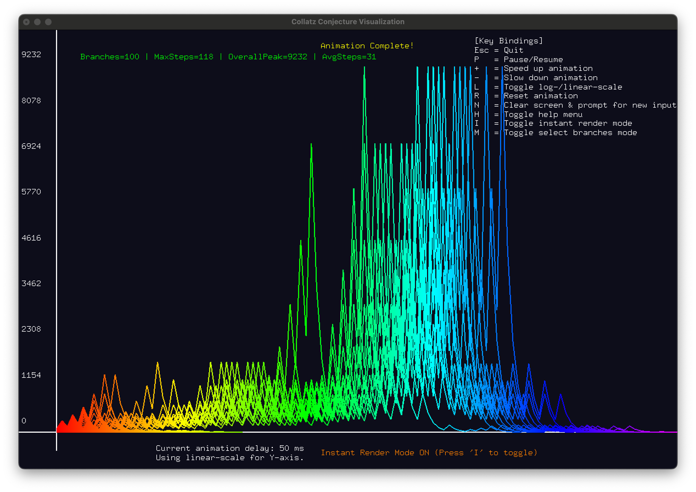
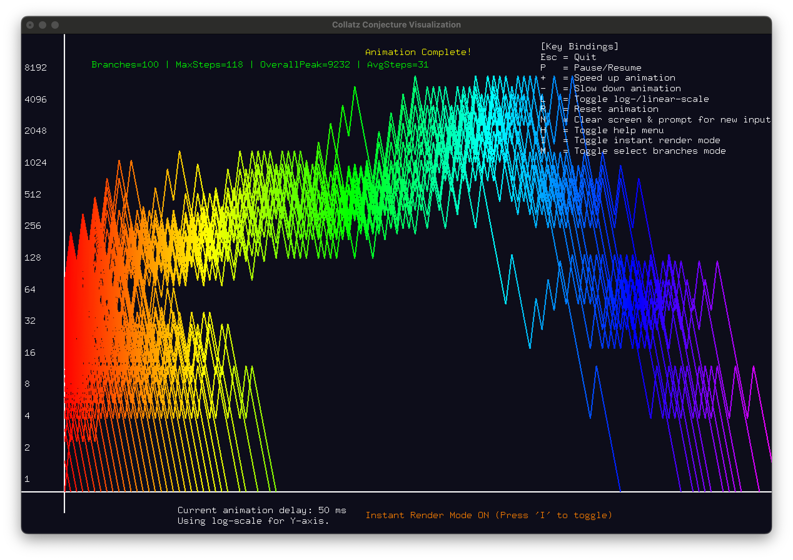
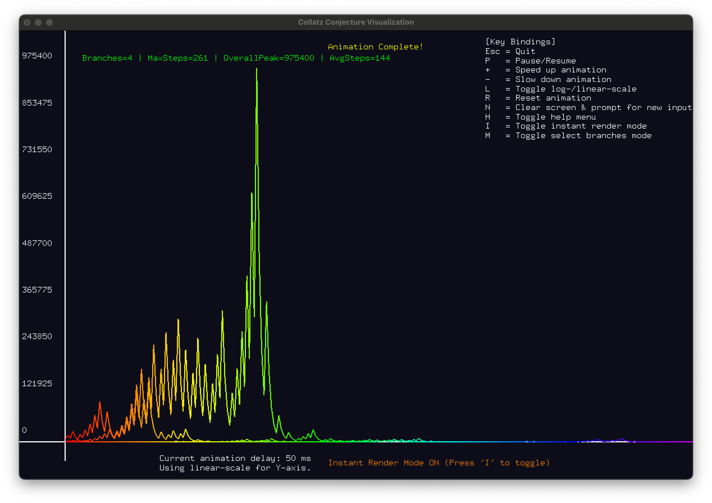
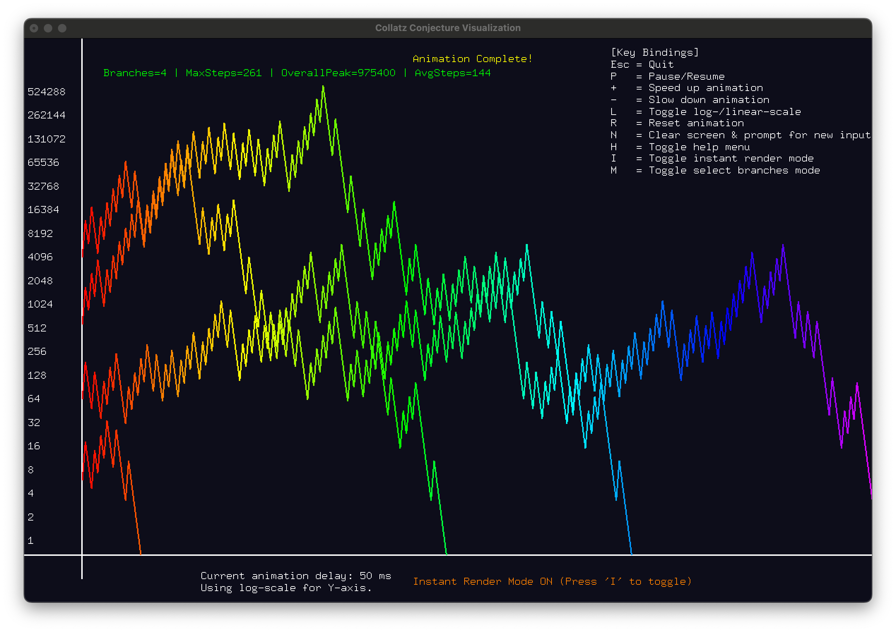
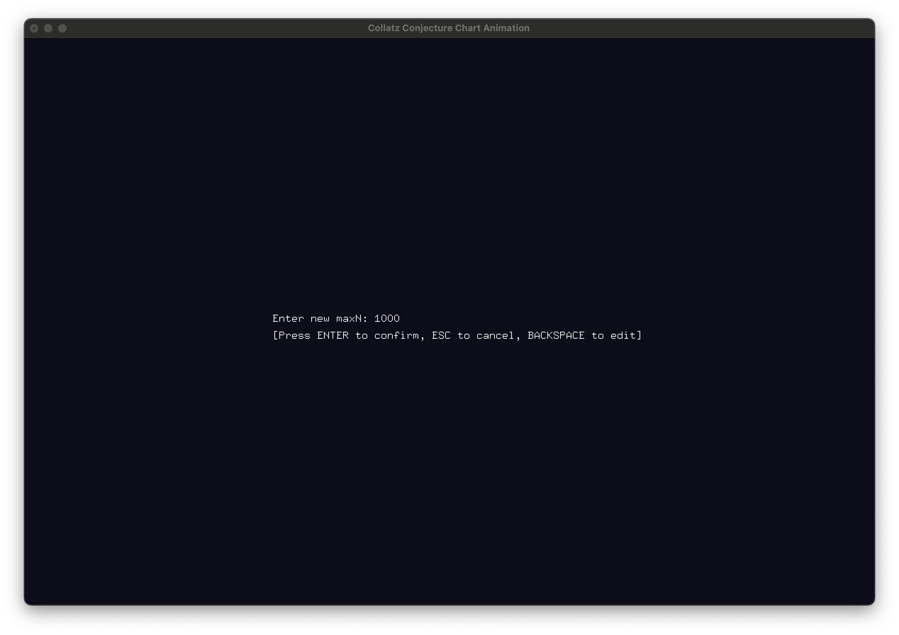
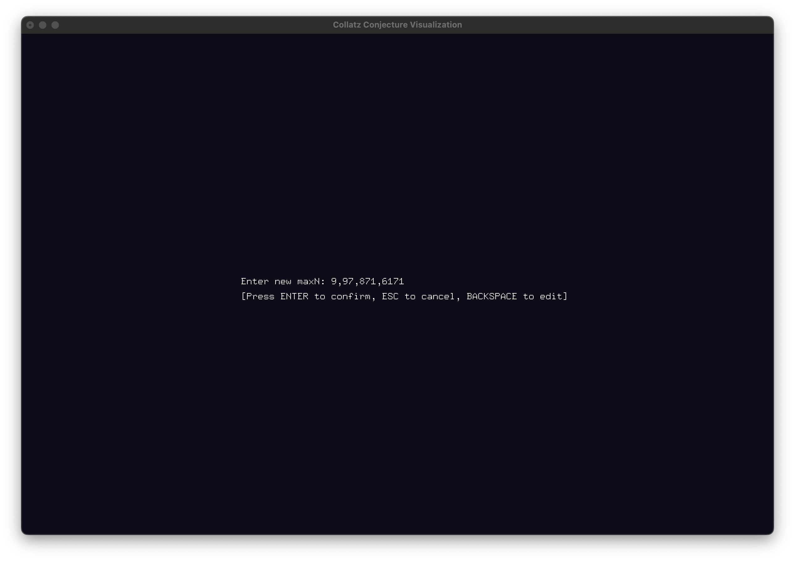
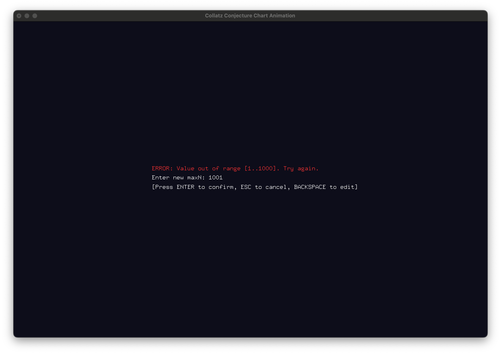
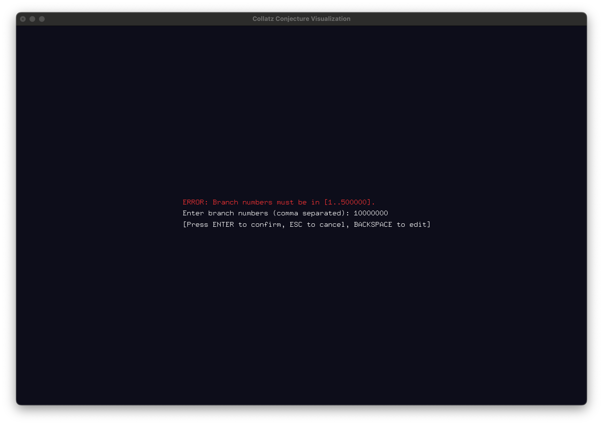

<a id="readme-top"></a>

[![Contributors][contributors-shield]][contributors-url]
[![Forks][forks-shield]][forks-url]
[![Stargazers][stars-shield]][stars-url]
[![Issues][issues-shield]][issues-url]
[![MIT License][license-shield]][license-url]
[![LinkedIn][linkedin-shield]][linkedin-url]

<br />
<div align="center">
  <h1>Collatz Conjecture Visualization</h1>
  <p>
    An interactive, real-time visualization of the Collatz conjecture built with C++ and OpenGL.
  </p>

  <p>
    <a href="https://github.com/CameronScarpati/collatz-conjecture-visualized/issues/new?labels=bug&template=bug-report---.md">Report Bug</a>
    &middot;
    <a href="https://github.com/CameronScarpati/collatz-conjecture-visualized/issues/new?labels=enhancement&template=feature-request---.md">Request Feature</a>
  </p>
</div>

## About

The [Collatz conjecture](https://en.wikipedia.org/wiki/Collatz_conjecture) is one of the most famous unsolved problems in mathematics. For any positive integer *n*, the sequence is defined as:

- If *n* is even: *n* &rarr; *n / 2*
- If *n* is odd: *n* &rarr; *3n + 1*

The conjecture states that this sequence always reaches 1, regardless of the starting value. This application renders thousands of these sequences simultaneously with animated, rainbow-colored trajectories, making it easy to explore the chaotic yet structured behavior of the conjecture.

### Key Features

- **Dual visualization modes** &mdash; Bulk mode (compute all sequences from 1 to *N*) and selective mode (pick specific starting values)
- **Animated rendering** with glow effects and rainbow color mapping via HSV-to-RGB conversion
- **Logarithmic & linear scaling** to compare sequences across vastly different magnitudes
- **Real-time statistics overlay** showing step counts, peak values, and averages
- **Efficient computation** using memoized sequence caching for O(1) lookups on previously computed values
- **Interactive controls** for animation speed, scale toggling, instant render, and dynamic input

### Built With

[![C++][cpp-badge]][cpp-url]
[![OpenGL][opengl-badge]][opengl-url]
[![GLUT][glut-badge]][glut-url]
[![CMake][cmake-badge]][cmake-url]

<p align="right">(<a href="#readme-top">back to top</a>)</p>

## Visualizations

| Linear Scale (10 branches) | Log Scale (10 branches) |
|:---:|:---:|
|  |  |

| Linear Scale (100 branches) | Log Scale (100 branches) |
|:---:|:---:|
|  |  |

| Selective Mode &mdash; Branches 9, 97, 871, 6171 (Linear) | Selective Mode &mdash; Branches 9, 97, 871, 6171 (Log) |
|:---:|:---:|
|  |  |

| Changing Max N | Selective Branch Input |
|:---:|:---:|
|  |  |

| Input Validation (Bulk) | Input Validation (Selective) |
|:---:|:---:|
|  |  |

<p align="right">(<a href="#readme-top">back to top</a>)</p>

## Getting Started

### Prerequisites

- A C++17-compatible compiler (GCC, Clang, or MSVC)
- OpenGL and GLUT (FreeGLUT)
- CMake 3.20+ (recommended) or manual compilation

**Linux:**
```sh
sudo apt install freeglut3-dev cmake
```

**macOS:**
```sh
brew install freeglut cmake
```

### Build & Run

**Using CMake (recommended):**
```sh
git clone https://github.com/CameronScarpati/collatz-conjecture-visualized.git
cd collatz-conjecture-visualized
cmake -B build -S .
cmake --build build
./build/CollatzConjecture
```

**Manual compilation (macOS):**
```sh
g++ -o CollatzConjecture collatz-visualization.cpp collatz_modes.cpp \
    -framework OpenGL -framework GLUT -std=c++17 -DGL_SILENCE_DEPRECATION
./CollatzConjecture
```

**Manual compilation (Linux):**
```sh
g++ -o CollatzConjecture collatz-visualization.cpp collatz_modes.cpp \
    -lGL -lglut -std=c++17
./CollatzConjecture
```

<p align="right">(<a href="#readme-top">back to top</a>)</p>

## Usage

Launch the application and it will begin animating Collatz sequences for numbers 1 through 10. Use the keyboard controls below to explore further.

### Keybindings

| Key | Action |
|-----|--------|
| `Esc` | Quit |
| `P` | Pause / Resume animation |
| `+` / `-` | Speed up / Slow down animation |
| `L` | Toggle logarithmic / linear Y-axis scale |
| `R` | Reset animation to the beginning |
| `N` | Clear screen and prompt for new input |
| `H` | Toggle help menu overlay |
| `I` | Toggle instant render mode |
| `M` | Toggle selective branch mode |

<p align="right">(<a href="#readme-top">back to top</a>)</p>

## Architecture

```
collatz_engine.h       Core computation engine with memoized caching
collatz_stats.h        Data structures for per-branch and overall statistics
collatz_modes.h/cpp    Bulk and selective computation modes
collatz-visualization.cpp   OpenGL rendering, animation loop, and input handling
CMakeLists.txt         Cross-platform build configuration
```

<p align="right">(<a href="#readme-top">back to top</a>)</p>

## Contributing

Contributions are welcome! Fork the repository, create a feature branch, and open a pull request.

1. Fork the Project
2. Create your Feature Branch (`git checkout -b feature/AmazingFeature`)
3. Commit your Changes (`git commit -m 'Add some AmazingFeature'`)
4. Push to the Branch (`git push origin feature/AmazingFeature`)
5. Open a Pull Request

<p align="right">(<a href="#readme-top">back to top</a>)</p>

## License

Distributed under the MIT License. See [`LICENSE`](LICENSE) for more information.

<p align="right">(<a href="#readme-top">back to top</a>)</p>

## Contact

Cameron J. Scarpati &mdash; [LinkedIn](https://linkedin.com/in/cameron-scarpati) &mdash; cameronscarp@gmail.com

Project Link: [https://github.com/CameronScarpati/collatz-conjecture-visualized](https://github.com/CameronScarpati/collatz-conjecture-visualized)

<p align="right">(<a href="#readme-top">back to top</a>)</p>

<!-- MARKDOWN LINKS & IMAGES -->
[contributors-shield]: https://img.shields.io/github/contributors/CameronScarpati/collatz-conjecture-visualized.svg?style=for-the-badge
[contributors-url]: https://github.com/CameronScarpati/collatz-conjecture-visualized/graphs/contributors
[forks-shield]: https://img.shields.io/github/forks/CameronScarpati/collatz-conjecture-visualized.svg?style=for-the-badge
[forks-url]: https://github.com/CameronScarpati/collatz-conjecture-visualized/network/members
[stars-shield]: https://img.shields.io/github/stars/CameronScarpati/collatz-conjecture-visualized.svg?style=for-the-badge
[stars-url]: https://github.com/CameronScarpati/collatz-conjecture-visualized/stargazers
[issues-shield]: https://img.shields.io/github/issues/CameronScarpati/collatz-conjecture-visualized.svg?style=for-the-badge
[issues-url]: https://github.com/CameronScarpati/collatz-conjecture-visualized/issues
[license-shield]: https://img.shields.io/github/license/CameronScarpati/collatz-conjecture-visualized.svg?style=for-the-badge
[license-url]: https://github.com/CameronScarpati/collatz-conjecture-visualized/blob/master/LICENSE
[linkedin-shield]: https://img.shields.io/badge/-LinkedIn-black.svg?style=for-the-badge&logo=linkedin&colorB=555
[linkedin-url]: https://linkedin.com/in/cameron-scarpati
[cpp-badge]: https://img.shields.io/badge/C++17-00599C?style=for-the-badge&logo=cplusplus&logoColor=white
[cpp-url]: https://cplusplus.com/
[opengl-badge]: https://img.shields.io/badge/OpenGL-5586A4?style=for-the-badge&logo=opengl&logoColor=white
[opengl-url]: https://www.opengl.org/
[glut-badge]: https://img.shields.io/badge/FreeGLUT-FCC624?style=for-the-badge&logo=opengl&logoColor=black
[glut-url]: https://freeglut.sourceforge.net/
[cmake-badge]: https://img.shields.io/badge/CMake-064F8C?style=for-the-badge&logo=cmake&logoColor=white
[cmake-url]: https://cmake.org/
