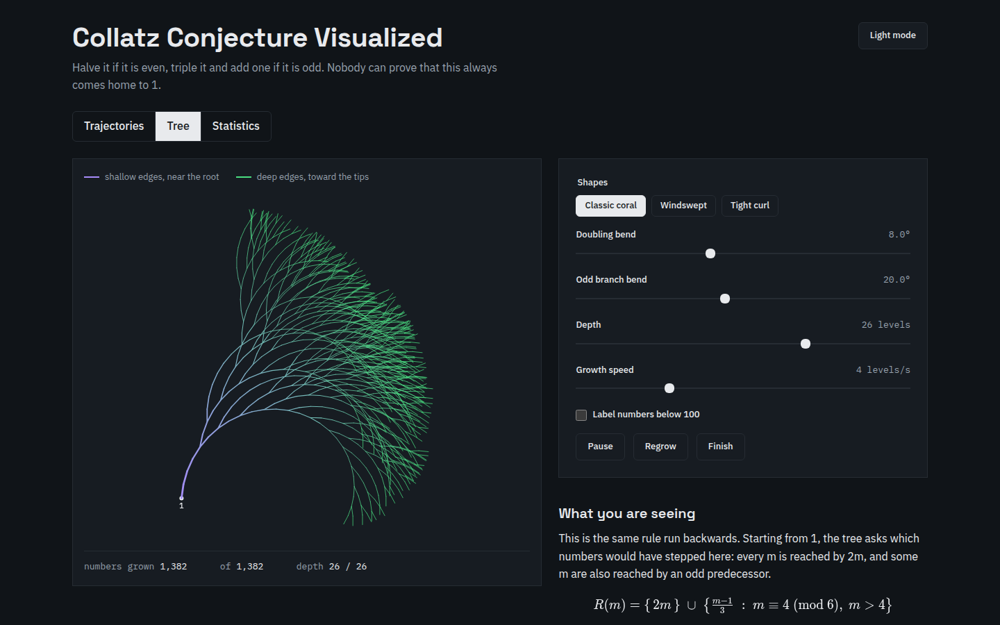
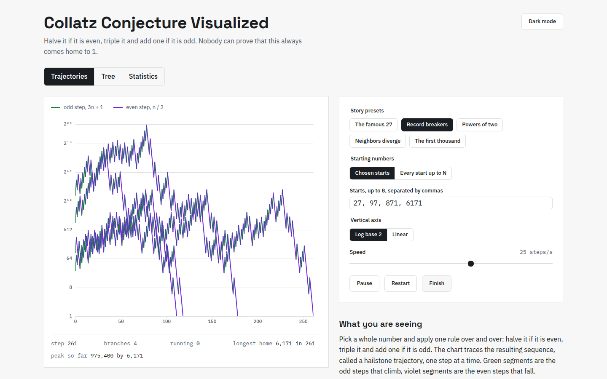
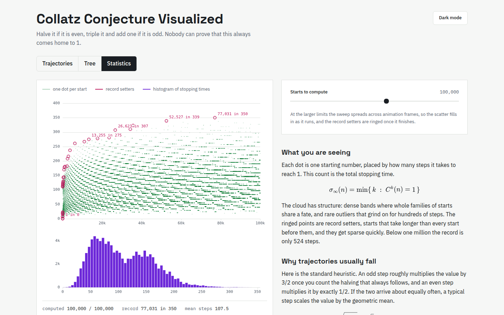

# Collatz Conjecture Visualized

[](https://github.com/CameronScarpati/collatz-conjecture-visualized/actions/workflows/ci.yml)

An interactive tour of the simplest unsolved problem in mathematics. Take any whole
number: halve it if it is even, triple it and add one if it is odd, and repeat. The
Collatz conjecture says you always reach 1, and nobody can prove it.

The app is live at
[collatz-conjecture-visualized.netlify.app](https://collatz-conjecture-visualized.netlify.app/).



## What it shows

The app has three views. **Trajectories** races the hailstone paths of chosen starting
numbers, drawing odd steps in green as they climb and even steps in violet as they
fall, with a comet head marking each sequence still in flight. **Tree** runs the rule
backwards, growing every number that leads to 1 outward from the root, with each edge
bending a little by the parity of its branch, so the whole structure comes out looking
like coral. **Statistics** sweeps the total stopping time of every start up to a
limit you choose, as high as one million, dots the results into a density cloud, rings
each record setter, and piles the counts into a histogram.



## Why it happens

A single odd step roughly multiplies a value by 3/2 once you count the halving that
always follows, and an even step halves it exactly. If both arrive about equally
often, a typical step scales the value by the square root of 3/4, which is below 1,
so typical trajectories drift downward. That heuristic explains everything the charts
show and proves nothing, because no argument yet forces any single trajectory to
behave typically. The conjecture has been verified far beyond every number this page
can plot, and it remains open.



## Using it

On wide screens each view keeps its chart pinned while the controls and a short
explanation scroll beside it; narrow screens stack them under the chart. The
trajectory explorer takes up to eight starting numbers typed directly, or a range
mode that races every start up to a limit you choose, as high as two thousand,
with the longest trajectory highlighted; presets tell the good stories, including
the famous 27 and the record breakers, and the axis toggles between log base 2 and
linear. The tree view has sliders for the two bend angles, the depth, and the
growth speed, plus shape presets and an option to label the small numbers. The
statistics view has one slider for how many starts to compute; at the larger
limits the sweep spreads across animation frames so the scatter fills in as it
runs. The trajectory and tree views have pause, restart, and finish controls and,
while animating, replay themselves when they complete. Every view honors the
reduced motion preference by rendering the finished picture immediately and
follows the light or dark theme with a manual toggle in the masthead.

## Running locally

```
npm install
npm run dev
```

`npm run build` type-checks and produces the production bundle, `npm run test` runs
the unit tests, and `npm run lint` runs oxlint.

## How it is built

React, TypeScript, and Vite, with all drawing done by hand on canvas inside a
requestAnimationFrame loop. Each animated chart layers two or three canvases so the
static parts stay put while each frame draws only what changed, and while animating,
the stopping time sweep computes in small batches that hand control back to the
browser every frame. D3 supplies only the scales. The math lives in pure modules with
no React imports, covered by unit tests pinned to known values such as the 111 steps
of 27 and the stopping time records below one hundred. KaTeX typesets the
mathematics. The site is a single static page, deployable anywhere; the live copy is
served from Netlify.

## Notes

This is a teaching demo, not a search for counterexamples. Arithmetic runs in plain
double precision with starts capped at 10^15 and a per-step guard that keeps every
value below 2^53, so a trajectory that would leave the exact integer range stops and
says so instead of silently losing precision; the conjecture itself has been verified
far beyond that by dedicated searches. The tree layout has a node budget of 25,000 as
a safety cap, which even the deepest setting stays under. This project began as a C++
OpenGL desktop app, which lives on in the git history.

## Credits

Built by [Cameron Scarpati](https://github.com/CameronScarpati). The coral rendering
of the reverse tree follows an idea by
[Edmund Harriss](https://en.wikipedia.org/wiki/Edmund_Harriss). Background reading:
the [Collatz conjecture](https://en.wikipedia.org/wiki/Collatz_conjecture) on
Wikipedia.

## License

MIT
