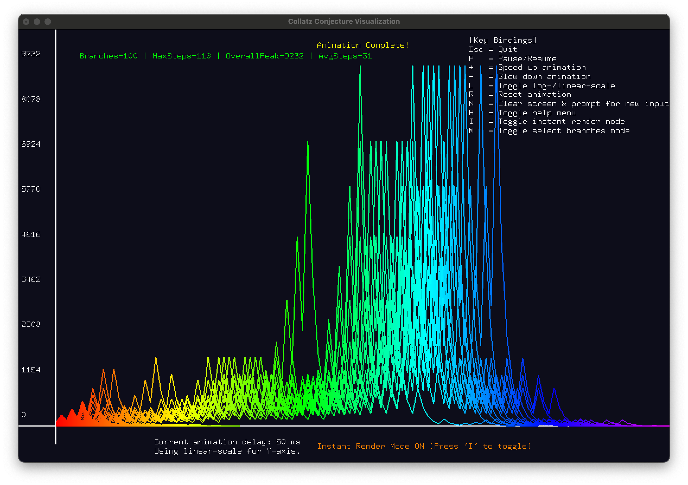
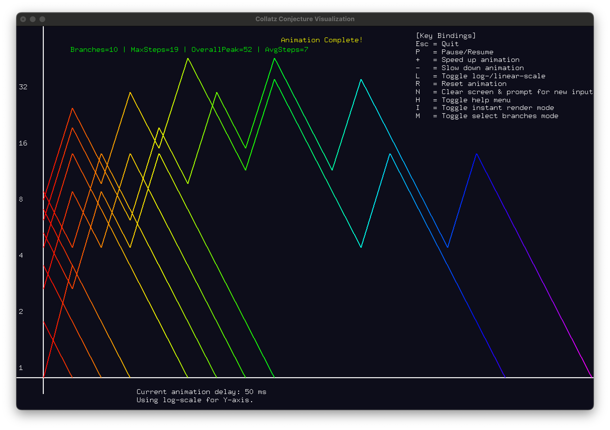
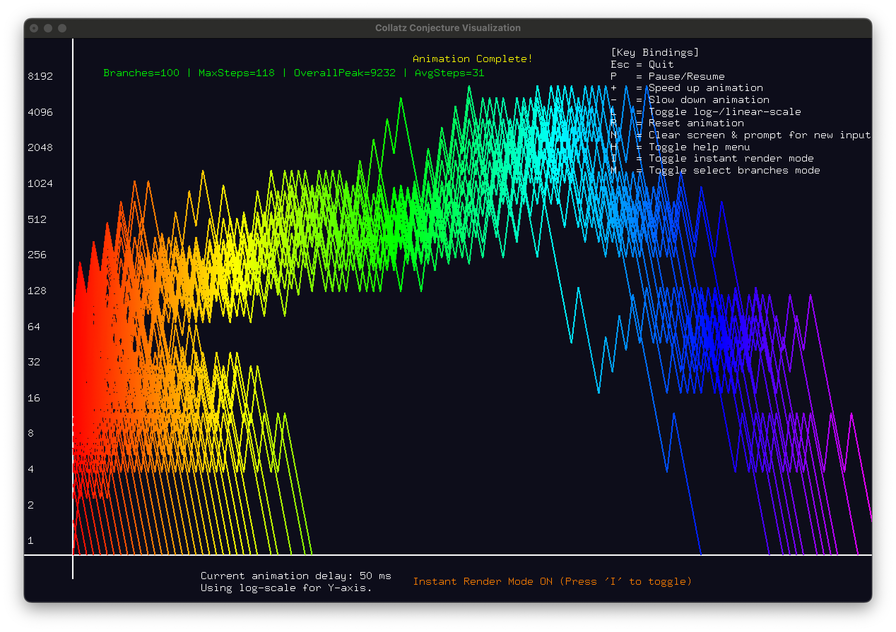
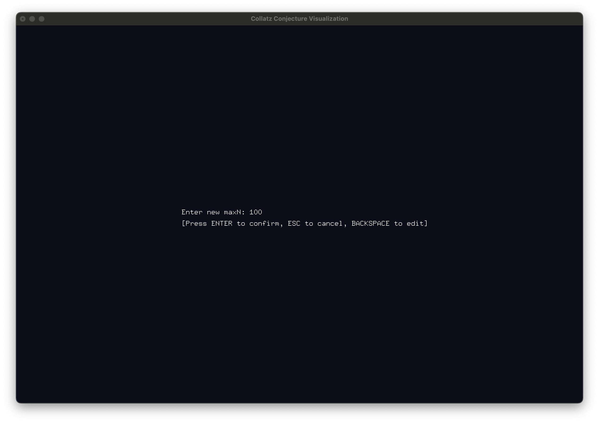
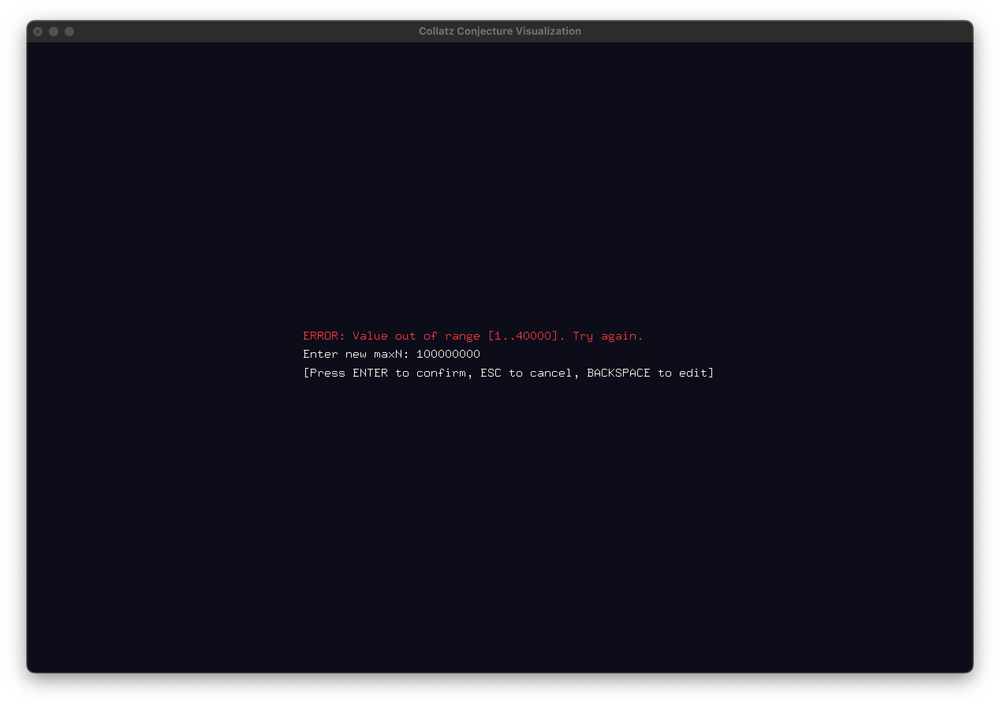
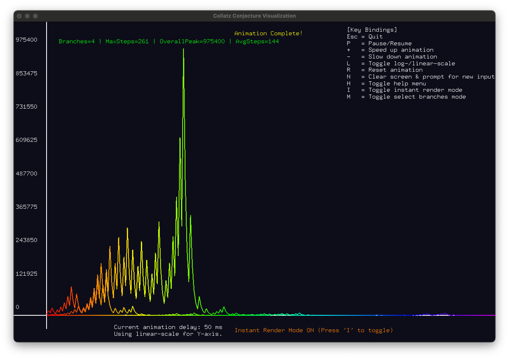
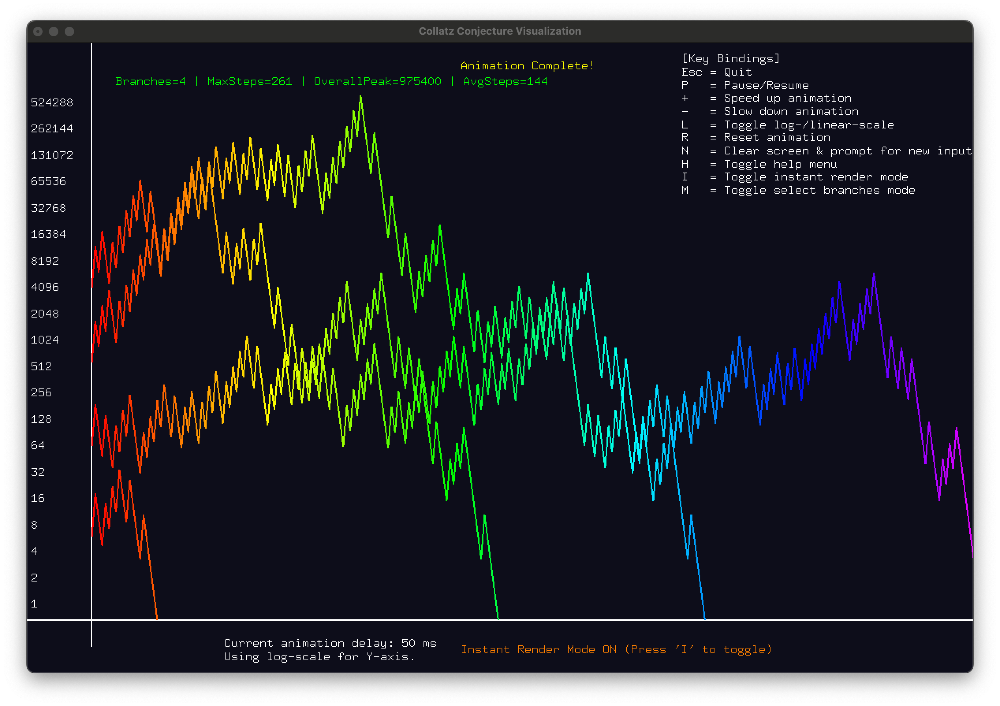
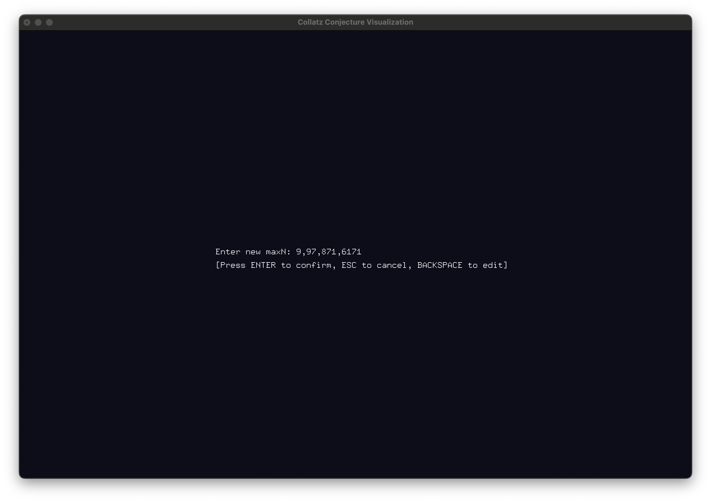
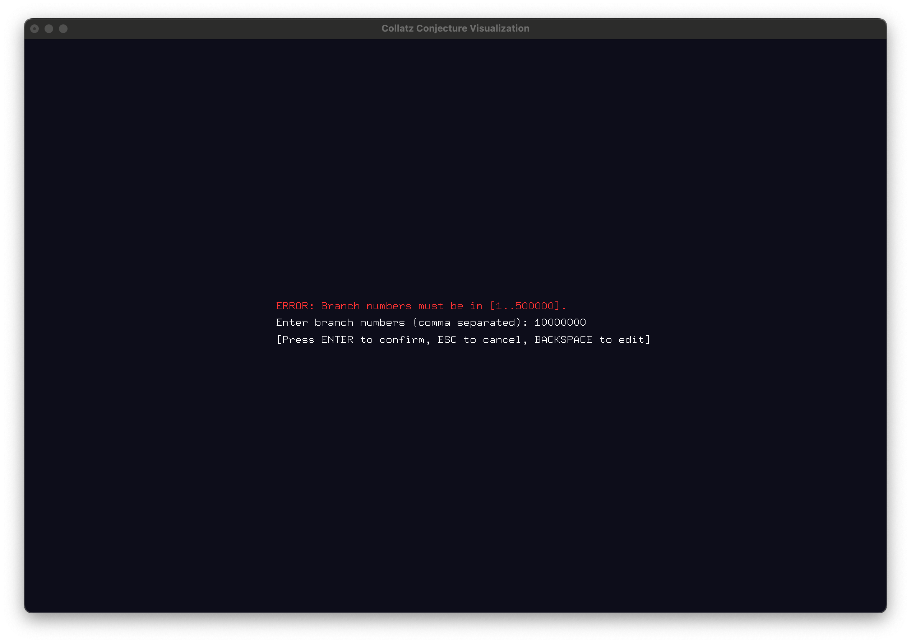

<a id="readme-top"></a>

[![Contributors][contributors-shield]][contributors-url]
[![Forks][forks-shield]][forks-url]
[![Stargazers][stars-shield]][stars-url]
[![Issues][issues-shield]][issues-url]
[![project_license][license-shield]][license-url]
[![LinkedIn][linkedin-shield]][linkedin-url]

<br />  
<div align="center">  
  <h3 align="center">Collatz Conjecture Visualization</h3>  

  <p align="center">  
    A visualization tool for exploring the Collatz Conjecture using OpenGL and C++.  
    <br />  
    <a href="https://github.com/CameronScarpati/collatz-conjecture-visualized"><strong>Explore the docs »</strong></a>  
    <br />  
    <br />  
    <a href="https://github.com/CameronScarpati/collatz-conjecture-visualized">View Demo</a>  
    &middot;  
    <a href="https://github.com/CameronScarpati/collatz-conjecture-visualized/issues/new?labels=bug&template=bug-report---.md">Report Bug</a>  
    &middot;  
    <a href="https://github.com/CameronScarpati/collatz-conjecture-visualized/issues/new?labels=enhancement&template=feature-request---.md">Request Feature</a>  
  </p>  
</div>  

### Visualizations

  
This visualization shows the Collatz sequences for 10 different starting numbers using a linear scale.

  
This visualization extends the linear scale view to 100 different starting numbers, revealing more structural patterns.

  
This log-scale visualization maps the trajectories of 10 numbers under the Collatz sequence, emphasizing relative growth differences.

  
With 100 branches in a log scale, this visualization highlights how sequences distribute over a broader range.


This image represents a visualization where the maximum N value (number of iterations or numbers considered) is changed.


This image may depict an error or anomaly encountered when modifying the maximum N value.

  
This visualization highlights the Collatz sequences for four specific starting numbers: **9, 97, 871, and 6171**. These numbers are well-known for having long trajectories before reaching 1. The linear scale allows for a direct comparison of the stopping times and peak values of each sequence.

  
This version of the visualization maps the same four branches (**9, 97, 871, and 6171**) but uses a **logarithmic scale** for the y-axis. This helps to better visualize the relative growth rates and differences in step progression, particularly for numbers that exhibit large fluctuations in value.

  
This image demonstrates the **new selective branch selection mode**, where users can manually specify which starting values they want to visualize. Instead of computing all numbers up to a maximum value, this mode allows focused exploration of specific Collatz trajectories.

  
This screenshot showcases an error handling scenario in selective branch input mode. It likely results from entering an invalid branch number (e.g., non-numeric input, negative values, or exceeding the allowed range). The error message provides feedback, helping users enter valid selections.

### Built With

* [](https://cplusplus.com/)
* [](https://www.opengl.org/)
* [](https://www.opengl.org/resources/libraries/glut/)
* [](https://cmake.org/)

<p align="right">(<a href="#readme-top">back to top</a>)</p>  

## Getting Started

To get a local copy up and running, follow these steps.

### Prerequisites

Ensure you have the following dependencies installed:

* OpenGL & GLUT
  ```sh  
  sudo apt install freeglut3-dev   # Linux  
  brew install freeglut            # macOS  
  ```  
* CMake (optional for build automation)
  ```sh  
  sudo apt install cmake           # Linux  
  brew install cmake               # macOS  
  ```  

### Installation

1. Clone the repo
   ```sh  
   git clone https://github.com/CameronScarpati/collatz-conjecture-visualized.git  
   ```  
2. Build the project
   ```sh  
   g++ -o Collatz-Conjecture-Visualization collatz-visualization.cpp collatz_modes.cpp -framework OpenGL -framework GLUT -std=c++17 -DGL_SILENCE_DEPRECATION
   ```  
3. Run the executable
   ```sh  
   ./Collatz-Conjecture-Visualization  
   ```  

<p align="right">(<a href="#readme-top">back to top</a>)</p>  

## Usage

This program visualizes the evolution of Collatz sequences for numbers from 1 to a user-defined maximum. Users can control animation speed, toggle logarithmic scaling, and input new values dynamically.

Keybindings:

- **Esc**: Quit
- **P**: Pause/Resume
- **+ / -**: Speed up / Slow down animation
- **L**: Toggle log-scale vs. linear-scale
- **R**: Reset animation
- **N**: Clear screen & prompt for new input
- **H**: Toggle help menu
- **I**: Toggle instant render mode
- **M**: Toggle selective branch selection mode

<p align="right">(<a href="#readme-top">back to top</a>)</p>  

## Contributing

Contributions are welcome! If you have suggestions to improve the project, fork the repository and create a pull request. You can also open an issue with the "enhancement" tag.

1. Fork the Project
2. Create your Feature Branch (`git checkout -b feature/AmazingFeature`)
3. Commit your Changes (`git commit -m 'Add some AmazingFeature'`)
4. Push to the Branch (`git push origin feature/AmazingFeature`)
5. Open a Pull Request

<p align="right">(<a href="#readme-top">back to top</a>)</p>  

### Top contributors:

<a href="https://github.com/CameronScarpati/collatz-conjecture-visualized/graphs/contributors">  
    
</a>  

## License

Distributed under the MIT License. See [`LICENSE.txt`](LICENSE.txt) for more information.

<p align="right">(<a href="#readme-top">back to top</a>)</p>  

## Contact

Cameron J. Scarpati - [LinkedIn](https://linkedin.com/in/cameron-scarpati) - cameronscarp@gmail.com

Project Link: [https://github.com/CameronScarpati/collatz-conjecture-visualized](https://github.com/CameronScarpati/collatz-conjecture-visualized)

<p align="right">(<a href="#readme-top">back to top</a>)</p>  

## Acknowledgments

* OpenGL & GLUT community
* C++ and STL libraries
* FreeGLUT for cross-platform support

<p align="right">(<a href="#readme-top">back to top</a>)</p>

<!-- MARKDOWN LINKS & IMAGES -->
<!-- https://www.markdownguide.org/basic-syntax/#reference-style-links -->
[contributors-shield]: https://img.shields.io/github/contributors/CameronScarpati/collatz-conjecture-visualized.svg?style=for-the-badge
[contributors-url]: https://github.com/CameronScarpati/collatz-conjecture-visualized/graphs/contributors
[forks-shield]: https://img.shields.io/github/forks/CameronScarpati/collatz-conjecture-visualized.svg?style=for-the-badge
[forks-url]: https://github.com/CameronScarpati/collatz-conjecture-visualized/network/members
[stars-shield]: https://img.shields.io/github/stars/CameronScarpati/collatz-conjecture-visualized.svg?style=for-the-badge
[stars-url]: https://github.com/CameronScarpati/collatz-conjecture-visualized/stargazers
[issues-shield]: https://img.shields.io/github/issues/CameronScarpati/collatz-conjecture-visualized.svg?style=for-the-badge
[issues-url]: https://github.com/CameronScarpati/collatz-conjecture-visualized/issues
[license-shield]: https://img.shields.io/github/license/CameronScarpati/collatz-conjecture-visualized.svg?style=for-the-badge
[license-url]: https://github.com/CameronScarpati/collatz-conjecture-visualized/blob/master/LICENSE.txt
[linkedin-shield]: https://img.shields.io/badge/-LinkedIn-black.svg?style=for-the-badge&logo=linkedin&colorB=555
[linkedin-url]: https://linkedin.com/in/cameron-scarpati
